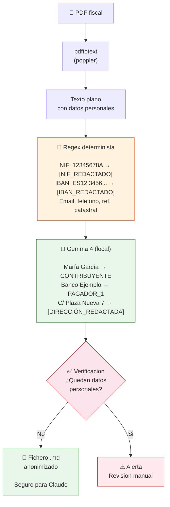

# Declaracion Renta AI

**Usa Claude Code para la declaracion de la renta (IRPF) en Espana. Privacidad total: tus datos personales nunca salen de tu ordenador.**

[](LICENSE)
[](https://www.python.org)
[](https://ollama.com)
[](https://claude.ai/code)

---

## El problema

Hacer la declaracion de la renta es complejo. Hay deducciones que no conoces, casillas que no entiendes, y datos repartidos entre 5 bancos distintos. Contratar un asesor fiscal cuesta entre 60 y 200 euros, y las herramientas online te obligan a subir todos tus datos personales a sus servidores.

## La solucion

Declaracion Renta AI combina dos capas de IA para darte asesoramiento fiscal de nivel profesional **sin comprometer tu privacidad**:

### Arquitectura de privacidad

```mermaid
flowchart LR
    subgraph LOCAL["🏠 Tu ordenador"]
        direction TB
        A["📄 Documentos fiscales\n(nominas, certificados,\ncomunicados bancarios)"]
        B["🔒 pdftotext\nExtraccion de texto"]
        C["🤖 Gemma 4 · Ollama\nAnonimizacion"]
        D["✅ Verificacion\nRegex post-check"]
        A --> B --> C --> D
    end

    subgraph CLOUD["☁️ API Claude"]
        direction TB
        E["📊 Analisis fiscal\nLiquidacion IRPF"]
        F["🔍 Auditoria\nDeducciones y\noptimizaciones"]
        G["📋 Guia paso a paso\nCasillas Renta Web"]
        E --> F --> G
    end

    D -- "Solo cifras\nsin datos personales" --> E

    style LOCAL fill:#e8f5e9,stroke:#2e7d32,stroke-width:2px
    style CLOUD fill:#e3f2fd,stroke:#1565c0,stroke-width:2px
    style A fill:#fff,stroke:#666
    style B fill:#fff,stroke:#666
    style C fill:#c8e6c9,stroke:#2e7d32
    style D fill:#c8e6c9,stroke:#2e7d32
    style E fill:#bbdefb,stroke:#1565c0
    style F fill:#bbdefb,stroke:#1565c0
    style G fill:#bbdefb,stroke:#1565c0
```



> **Principio clave**: Tus datos personales (nombre, NIF, direccion, IBAN) **nunca salen de tu ordenador**.
> Claude solo recibe cifras anonimizadas: `€2.084,10`, `PAGADOR_1`, `CONTRIBUYENTE`.

### Detalle por capa

| Capa | Donde se ejecuta | Que hace | Datos personales |
|------|-------------------|----------|------------------|
| **Capa 1** - Gemma 4 | Tu ordenador (Ollama) | Extrae texto de PDFs y anonimiza nombres, NIF, direcciones, IBAN | **SI los ve**, pero nunca salen de tu maquina |
| **Capa 2** - Claude | API de Anthropic | Analiza cifras, calcula impuestos, encuentra deducciones | **NUNCA los ve** - solo recibe datos anonimizados |

### Pipeline de anonimizacion



## Que hace

- **Mapa fiscal completo**: Consolida informacion de todos tus bancos y brokers en un solo cuadro
- **Liquidacion del IRPF**: Calcula tu declaracion paso a paso siguiendo el esquema oficial
- **Auditoria de optimizacion**: Revisa 18+ deducciones autonomicas (Andalucia) y todas las estatales
- **Guia paso a paso**: Te indica exactamente que casillas modificar en Renta Web
- **Comparativa interanual**: Analiza como ha evolucionado tu patrimonio respecto al ejercicio anterior

### Demo: el flujo en accion

<details>
<summary><strong>Ver demo completa (terminal)</strong></summary>

```
$ python3 anonimizar.py ~/Descargas/borrador_renta.pdf ~/Descargas/certificado_banco.pdf

============================================================
  EXTRACTOR FISCAL ANONIMO
  Modelo: gemma4:e4b (100% local)
  pdftotext: disponible
  Archivos: 2
============================================================

[1/2] Procesando: borrador_renta.pdf
  Texto extraido: 299 lineas con contenido
  Paso 1/2: Redaccion automatica (regex)...
    ├── NIF detectado y redactado
    ├── IBAN detectado y redactado
    └── 3 telefonos personales redactados
  Paso 2/2: Anonimizacion de nombres y direcciones (gemma4:e4b, local)...
    ├── "Maria Garcia Lopez" → CONTRIBUYENTE
    ├── "Banco Ejemplo S.A." → PAGADOR_1
    └── "C/ Plaza Nueva, 7, 3B, Granada" → [DIRECCION_REDACTADA, provincia: GR]
  ✓  Verificacion OK — no se detectan datos personales residuales
  Cobertura: 298/299 lineas (100%)

[2/2] Procesando: certificado_banco.pdf
  Texto extraido: 87 lineas con contenido
  Paso 1/2: Redaccion automatica (regex)...
  Paso 2/2: Anonimizacion de nombres y direcciones (gemma4:e4b, local)...
  ✓  Verificacion OK
  Cobertura: 87/87 lineas (100%)

============================================================
  EXTRACCION COMPLETADA
  Resultado: ./extracciones/fiscal_anonimo_20260420_143200.md
  Cobertura total: 385/386 lineas (100%)
============================================================

$ claude
> /declaracion-renta
> Aqui tienes mis datos: ./extracciones/fiscal_anonimo_20260420_143200.md

Claude: He analizado tu borrador y certificado bancario. Aqui tienes tu mapa fiscal:

  ════════════════════════════════════════
           MAPA FISCAL — CONTRIBUYENTE
           Ejercicio 2025 | Andalucia
  ════════════════════════════════════════
  RENTAS
  ├── Trabajo personal ............. €32.000,00
  ├── Capital mobiliario ...........    €425,30
  └── RENTA TOTAL .................. €32.425,30

  RESULTADO SIN OPTIMIZAR: A devolver €985,02

  ⚠ He encontrado 3 optimizaciones por valor de €700:
  1. Deduccion practica deportiva:     €45
  2. Aportacion plan de pensiones:    €450
  3. Donativo a ONG (primeros €250):  €200

  RESULTADO OPTIMIZADO: A devolver €1.685,02

  ¿Quieres que te guie paso a paso para aplicarlas en Renta Web?
```

</details>

### Deducciones que revisa automaticamente

<details>
<summary><strong>Deducciones autonomicas de Andalucia (18)</strong></summary>

1. Inversion en vivienda habitual protegida
2. Alquiler de vivienda habitual (hasta 1.200 euros)
3. Mejora de la sostenibilidad de la vivienda habitual
4. Nacimiento, adopcion o acogimiento
5. Adopcion internacional de menores
6. Familia numerosa
7. Familia monoparental
8. Ascendientes mayores de 75 anos
9. Personas con discapacidad
10. Asistencia a personas con discapacidad
11. Ayuda domestica
12. Inversion en acciones/participaciones de sociedades
13. Gastos de defensa juridica laboral
14. Donativos con finalidad ecologica
15. Donativos a entidades para I+D+i
16. Practica deportiva (15%, hasta 100 euros)
17. Gastos veterinarios de animales de compania
18. Celiaquia

</details>

<details>
<summary><strong>Deducciones estatales</strong></summary>

- Inversion en vivienda habitual (regimen transitorio pre-2013)
- Donativos a entidades acogidas a la Ley 49/2002
- Inversion en empresas de nueva creacion
- Maternidad
- Familia numerosa / personas con discapacidad a cargo
- Obras de mejora de eficiencia energetica
- Vehiculo electrico e infraestructura de recarga
- Planes de pensiones y sistemas de prevision social

</details>

## Requisitos

- **Python 3.9+**
- **[Ollama](https://ollama.com)** con el modelo Gemma 4
- **[Claude Code](https://claude.ai/code)** (CLI, desktop o web)
- **poppler** (para `pdftotext`)

## Instalacion

### 1. Instala las dependencias

```bash
# macOS
brew install ollama poppler

# Linux (Ubuntu/Debian)
sudo apt install poppler-utils
curl -fsSL https://ollama.com/install.sh | sh
```

### 2. Descarga el modelo Gemma 4

```bash
ollama pull gemma4:e4b
```

### 3. Clona este repositorio

```bash
git clone https://github.com/perrorapidito/declaracion-renta-ai.git
cd declaracion-renta-ai
```

### 4. Instala el skill en Claude Code

```bash
# Copia el skill a tu directorio de skills de Claude Code
mkdir -p ~/.claude/skills/declaracion-renta
cp SKILL.md ~/.claude/skills/declaracion-renta/SKILL.md
cp anonimizar.py ~/.claude/skills/declaracion-renta/anonimizar.py
```

Luego anade el skill a tu configuracion de Claude Code (`~/.claude/settings.json`):

```json
{
  "skills": {
    "declaracion-renta": {
      "path": "~/.claude/skills/declaracion-renta/SKILL.md"
    }
  }
}
```

## Uso

### Paso 1: Anonimiza tus documentos

```bash
# Un solo documento
python3 anonimizar.py ~/Descargas/datos_fiscales.pdf

# Varios documentos a la vez
python3 anonimizar.py ~/Descargas/nomina.pdf ~/Descargas/certificado_banco.pdf ~/Descargas/borrador.pdf
```

El script genera un fichero Markdown anonimizado en `./extracciones/`. Este fichero es **seguro para compartir** con Claude.

### Paso 2: Activa el skill en Claude Code

```
/declaracion-renta
```

### Paso 3: Comparte el fichero anonimizado

Indica la ruta del fichero generado y Claude te guiara paso a paso por toda la declaracion.

## Ejemplos

En la carpeta [`examples/`](examples/) encontraras:

| Archivo | Que muestra |
|---------|-------------|
| [`ejemplo_documento_original.txt`](examples/ejemplo_documento_original.txt) | Como se ve un documento fiscal **antes** de anonimizar (datos ficticios) |
| [`ejemplo_documento_anonimizado.md`](examples/ejemplo_documento_anonimizado.md) | El **mismo documento despues** de pasar por el script — sin datos personales |
| [`ejemplo_sesion_claude.md`](examples/ejemplo_sesion_claude.md) | Una **sesion completa** con Claude: mapa fiscal, liquidacion, optimizaciones y guia paso a paso |

## Ejemplo rapido

```
$ python3 anonimizar.py ~/Descargas/borrador_renta_2025.pdf

============================================================
  EXTRACTOR FISCAL ANONIMO
  Modelo: gemma4:e4b (100% local)
  pdftotext: disponible
  Archivos: 1
============================================================

[1/1] Procesando: borrador_renta_2025.pdf
  Texto extraido: 299 lineas con contenido
  Paso 1/2: Redaccion automatica (regex)...
  Paso 2/2: Anonimizacion de nombres y direcciones (gemma4:e4b, local)...
  Verificacion OK - no se detectan datos personales residuales
  Cobertura: 298/299 lineas (100%)

============================================================
  EXTRACCION COMPLETADA
  Resultado: ./extracciones/fiscal_anonimo_20260420_201250.md
============================================================
```

Luego en Claude Code:

```
> /declaracion-renta
> Aqui tienes mi borrador anonimizado: ./extracciones/fiscal_anonimo_20260420_201250.md

Claude analiza tu borrador y te dice:
- Que deducciones te faltan
- Que casillas hay que corregir
- Cuanto puedes ahorrarte
- Paso a paso como hacerlo en Renta Web
```

## Como funciona la anonimizacion

El script aplica un proceso de dos pasos:

### Paso 1: Regex (instantaneo, determinista)
Detecta y redacta automaticamente patrones conocidos:
- NIF/DNI/NIE
- IBAN y cuentas bancarias
- Telefonos personales
- Emails
- Referencias catastrales
- Codigos seguros de verificacion

### Paso 2: Gemma 4 (IA local)
Solo se encarga de lo que las regex no pueden detectar:
- Nombres y apellidos de personas
- Nombres de empresas y entidades
- Direcciones postales completas

### Paso 3: Verificacion automatica
Despues de la anonimizacion, el script verifica que no quedan datos personales residuales.

## Formatos soportados

| Formato | Metodo de extraccion |
|---------|---------------------|
| PDF (con texto) | `pdftotext` (poppler) |
| PDF (escaneado) | Gemma 4 vision |
| Imagenes (JPG, PNG) | Gemma 4 vision |
| Texto plano | Lectura directa |
| XML | Lectura directa |

## Limitaciones

- **Solo Andalucia**: Las deducciones autonomicas estan configuradas para Andalucia. Se pueden adaptar a otras comunidades editando el SKILL.md.
- **Ejercicio 2025**: Las escalas y deducciones estan actualizadas para el ejercicio 2025. Se actualizaran anualmente.
- **No es asesoramiento profesional**: Esta herramienta es una ayuda, no sustituye al criterio de un asesor fiscal colegiado. Consulta con un profesional ante dudas sobre tu situacion particular.
- **Documentos muy largos**: Gemma 4 tiene un limite de contexto. Documentos de mas de ~1500 lineas pueden requerir procesamiento directo con regex (sin Gemma).

## Contribuir

Las contribuciones son bienvenidas. Algunas ideas:

- [ ] Anadir deducciones autonomicas de otras comunidades (Madrid, Cataluna, Valencia, etc.)
- [ ] Soporte para declaracion conjunta
- [ ] Integracion con datos abiertos de la AEAT
- [ ] Mejorar la extraccion de PDFs escaneados
- [ ] Tests automatizados con documentos de ejemplo anonimizados
- [ ] Soporte para actividades economicas (autonomos)

## Disclaimer

> **Esta herramienta no constituye asesoramiento fiscal profesional.** Los calculos y recomendaciones son orientativos. El contribuyente es el unico responsable de la veracidad y correccion de su declaracion de la renta. Ante cualquier duda sobre tu situacion fiscal particular, consulta con un asesor fiscal colegiado. Los creadores de esta herramienta no se responsabilizan de errores, omisiones o perjuicios derivados de su uso.

## Licencia

[MIT](LICENSE) - Usa, modifica y distribuye libremente.

---

Hecho con Claude Code + Gemma 4 | Privacidad por diseno
